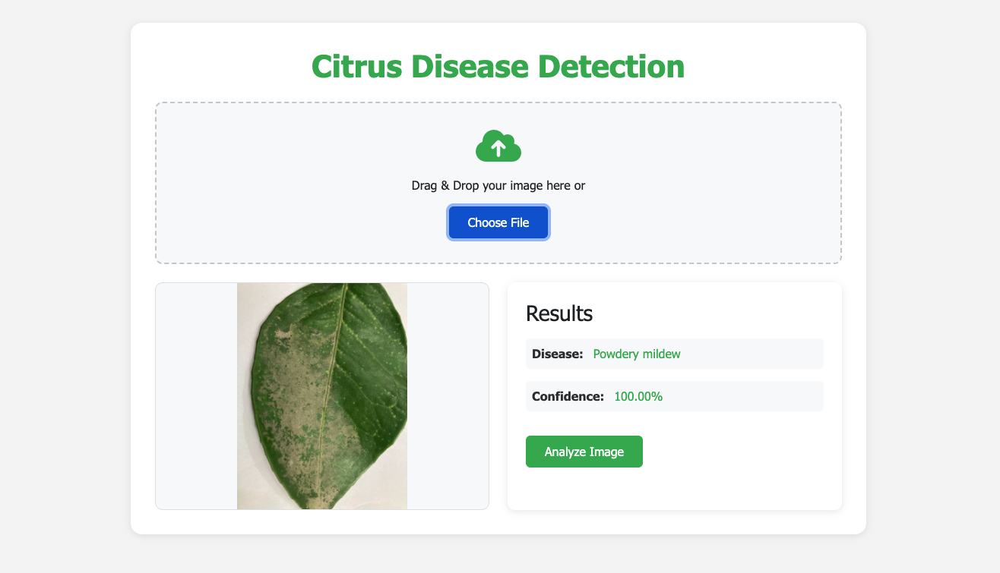

# Citrus Disease Detection

An intelligent system that uses computer vision to detect citrus diseases from leaf images.



## Features

### Disease Detection
- Upload images through drag-and-drop or file selection
- Real-time image preview
- Accurate classification of citrus diseases:
  - Greening
  - Canker
  - Mealybugs
  - Healthy
  - Powdery mildew
  - Spiny whitefly
- Confidence score for predictions

## Technology Stack

- **Backend**: Flask, TensorFlow
- **Frontend**: HTML5, CSS3, JavaScript
- **ML/AI**: Custom CNN model for disease detection
- **Development Tools**: Task, Python virtual environments
- **Model Training**: Jupyter Notebook

## Prerequisites

- Python 3.10
- Task (go-task) - For automation
- Jupyter Notebook (for model training)
- Required Python packages (see requirements.txt)

## Quick Start

1. Install Task (if not already installed):
   ```bash
   # macOS
   brew install go-task

   # Linux
   sh -c "$(curl --location https://taskfile.dev/install.sh)" -- -d -b ~/.local/bin
   ```

2. Clone the repository:
   ```bash
   git clone <repository-url>
   cd my_citrus_leaf_detection
   ```

3. Model Training (Optional):
   - Open `orange_leaf_diseases_classification.ipynb` in Jupyter Notebook
   - Follow the notebook to train your own model
   - The trained model will be saved as `citrus_inceptionv3_finetuned_best.keras`

4. Add your trained model:
   - Place your `citrus_inceptionv3_finetuned_best.keras` file in the `model/` directory
   - Or use the pre-trained model from the repository

5. Setup and run:
   ```bash
   # First, set up the virtual environment
   task setup-venv

   # Then run the application
   task run
   ```

6. Open your browser and navigate to:
   ```
   http://localhost:5001
   ```

## Project Structure

```
my_citrus_leaf_detection/
├── app.py                 # Main Flask application
├── model/                 # Directory for ML model
├── static/               # Static assets
│   ├── css/
│   └── js/
├── templates/            # HTML templates
├── requirements.txt      # Python dependencies
├── Taskfile.yml         # Task automation
└── orange_leaf_diseases_classification.ipynb  # Model training notebook
```

## Model Training

The project includes a Jupyter notebook (`orange_leaf_diseases_classification.ipynb`) that demonstrates:
- Data preprocessing and augmentation
- CNN model architecture (InceptionV3)
- Model training and fine-tuning
- Model evaluation and metrics
- Model export for production use

To train your own model:
1. Open the notebook in Jupyter
2. Follow the step-by-step instructions
3. The trained model will be saved in the `model/` directory

## Available Tasks

- `task`: List all available tasks
- `task setup-venv`: Create and set up the virtual environment
- `task run`: Run the Flask application
- `task clean`: Clean up generated files and virtual environment

## Usage

### Image Upload
1. Drag and drop an image or click to select
2. Preview the image
3. Click "Analyze Image" to get the diagnosis
4. View the predicted disease and confidence score

## Development

### Adding New Features
1. Create a new branch
2. Make your changes
3. Test thoroughly
4. Submit a pull request

## Troubleshooting

### Common Issues
1. Model not found:
   - Ensure `citrus_inceptionv3_finetuned_best.keras` is in the `model/` directory
   - If you haven't trained the model, use the pre-trained model from the repository

2. Port already in use:
   - The application uses port 5001 by default
   - If port 5001 is in use, you can modify the port in `app.py`

3. Dependencies issues:
   - Run `task clean` followed by `task setup-venv`

4. Jupyter Notebook issues:
   - Ensure all required packages are installed
   - Check GPU availability if using GPU acceleration
